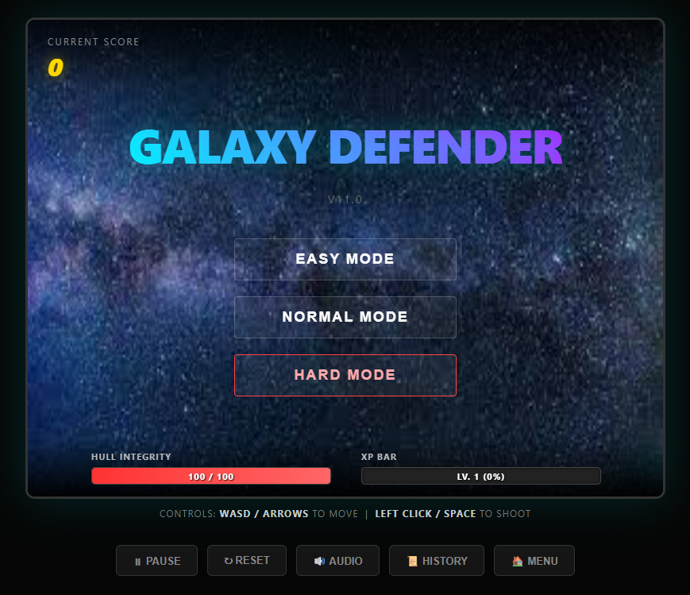
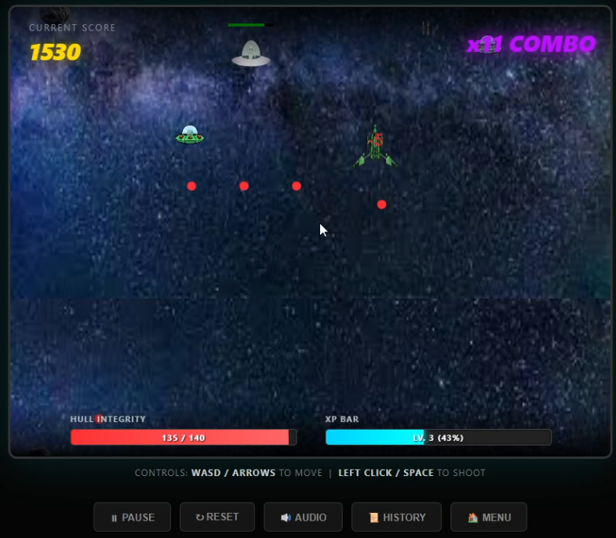
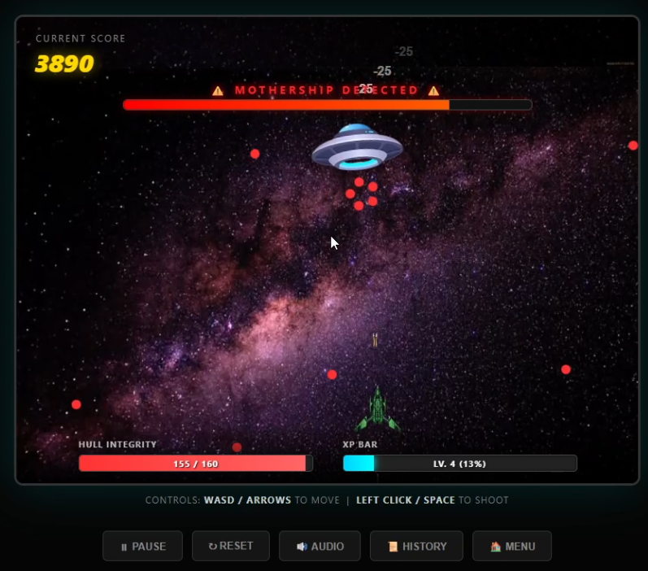
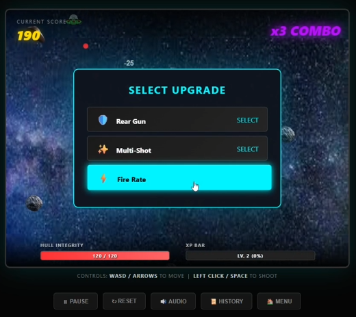
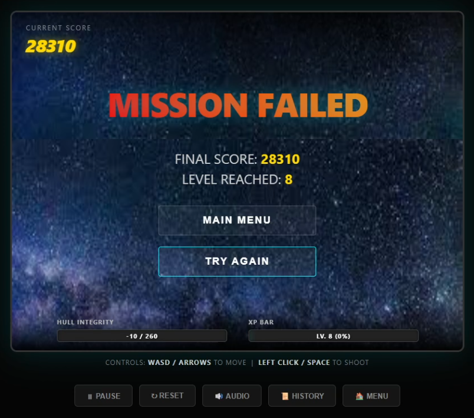
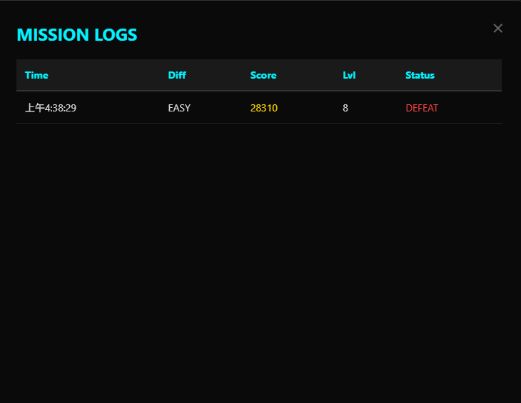
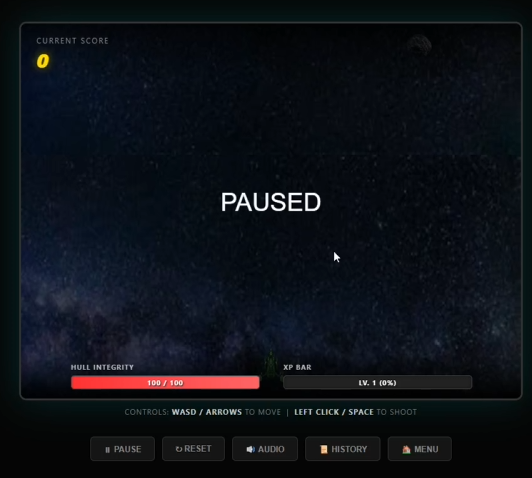

# Galaxy Defender

A 2D Action / Arcade game developed for the browser.
Defeat enemies, build combos, and upgrade your ship to survive the galaxy.

### 🚀 Play Now
[▶️ Click ME TO PLAY](https://LittleSurvival.github.io/galaxy-defender/)

---

## 🎮 Controls

| Action | Key / Input |
| :--- | :--- |
| **Move** | WASD / Arrow Keys |
| **Attack** | Space / Mouse Left Click |
| **Pause** | P |

---

## 📸 Game Overview

### Start Menu
The main entry point of the game.

### Combat & Combo System
Maintain your hit streak to build up the combo counter and maximize your score.

### Boss Battles
Face off against powerful bosses at the end of stages.

### Upgrade System
Choose from random upgrades to enhance your abilities during the run.

---

## 📊 UI & Progression

### Mission Results
View your performance statistics after completing a mission.

### Game History & Pause
Track your previous records and manage game settings.
| History | Pause Menu |
| :-: | :-: |
|  |  |

---

## 🛠️ Tech Stack

* **Platform:** Web (HTML5 / Canvas)
* **Language:** JavaScript / TypeScript (or relevant language)

---

## 👤 Author

Developed by **LittleSurvival**.